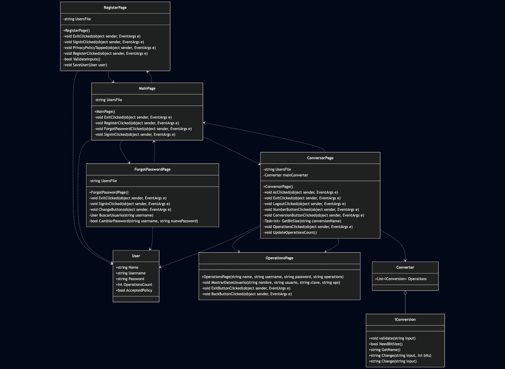

# Design Detailed Document 

## Table of Contents
1. [Introduction]
3. [Description]
3. [Problems]
4. [Conclusions]

---

## Introduction
- This is a detailed design document for the Converter Calculator app. It explains what it does, the issues while building it, and the conclusions after finishing the project.
---

## Description
- This converter is a calculator-style app that starts with a sign-in page where you can: exit the program, go to the register page, or go to the recover a forgotten password page. The register page is where you can create a new account. In the recover a forgotten password page you can enter your username on the sign-in page and if it's correct, you'll be able to reset your password. Ypu can enter the converter page whenyou sign in succesfully, the converter page is linked to a program that handles 5 types of conversions (binary, decimal, hexadecimal, octal and two's complement). There's also an operations page (inside the converter page) that displays the user information.

## Problems 
- Compatibity issues of xcode with my mac.
- Problems when adding users and storing them.
- Some times when I run the program the app doesn't opens at the first try and other times it does with no particular reason.
---

## Conclusions

- This project helped deepen my understanding of MAUI and its integration with C#, while also improving my ability to structure applications using classes.
